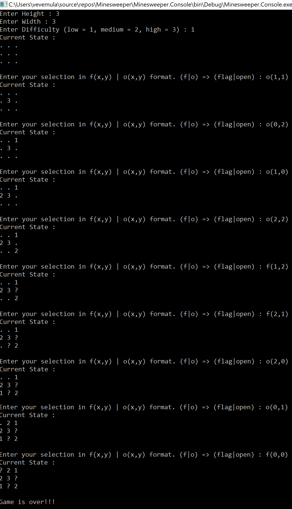
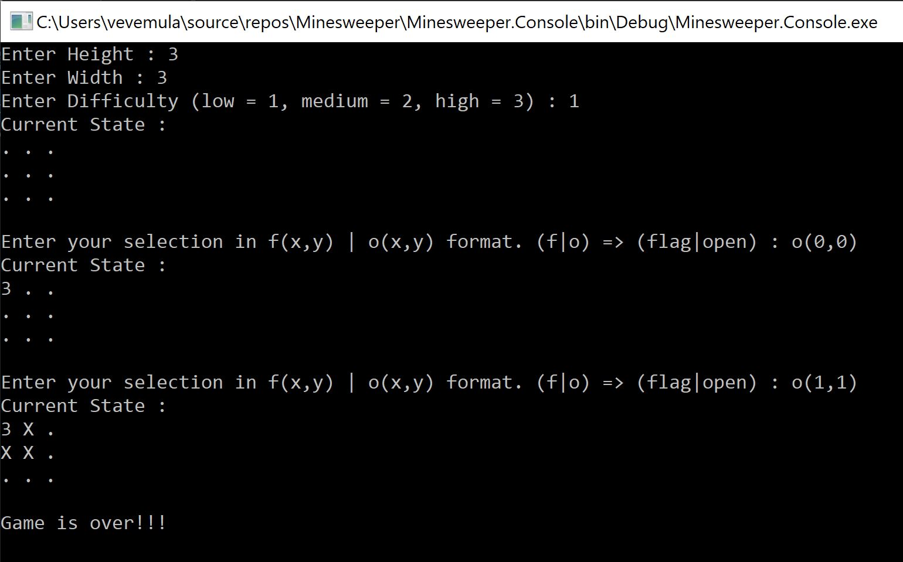

# Minesweeper in Csharp

You are presented with a board of squares. Some squares contain mines (bombs), others don't. 
If you click on a square containing a bomb, you lose. If you manage to click all the squares (without clicking on any bombs) you win.
Clicking a square which doesn't have a bomb reveals the number of neighbouring squares containing bombs. 
Use this information plus some guess work to avoid the bombs.
To open a square as a point use **o(X,Y)**. 
To mark a square you think is a bomb, use **f(X,Y)**.

Run the Minesweeper Console Project.

#### Success Game

#### Failed Game

